# 🚚 Awesome Fleet Management 



<p align="center">
  <a href="https://github.com/ishandutta2007/Awesome-Awesome-Awesome"></a><a href="https://discord.gg/jc4xtF58Ve"></a>
  <a href="https://github.com/ishandutta2007/Awesome-Fleet-Management/stargazers"></a>
  <a href="https://github.com/ishandutta2007/Awesome-Fleet-Management/network/members"></a>
  <a href="https://github.com/ishandutta2007/Awesome-Fleet-Management/blob/main/LICENSE"></a>
  <a href="https://github.com/ishandutta2007"></a>
</p>

## 📌 Top Fleet Management Platforms & Telematics Ecosystem
> **Curated List of Commercial SaaS Products, Telematics Software, ELD Compliance Tools & Open-Source Fleet Solutions.**  
> *Focused on GPS Tracking, Hours of Service (HOS), AI Video Safety Dash Cams, Vehicle Maintenance & Fleet Analytics.*  
> **Last updated: September 2026** 📅

This repository tracks notable **SaaS platforms** and **open-source GitHub projects** for **Fleet Management**. These software suites provide real-time vehicle tracking, electronic logging devices (ELD), safety cameras, preventive maintenance, fuel consumption insights, and compliance tools for commercial logistics fleets.

---

## 📑 Table of Contents
- [🌐 SaaS / Hosted Platforms](#-saashosted-platforms)
- [💻 Open-Source GitHub Projects](#-open-source-github-projects)
- [🤝 How to Contribute](#-how-to-contribute)
- [💖 Support & Community](#-support--community)
- [📈 Star History](#-star-history)
- [⚠️ Disclaimer](#%EF%B8%8F-disclaimer)

---

## 🌐 SaaS/Hosted Platforms

> **📊 Market Insights & Industry Overview**:  
> The Global Fleet Management Market size is estimated at **$28.6 Billion in 2024** and is projected to reach **$55.6 Billion by 2029** (CAGR of ~14.3%). The commercial sector is **moderately fragmented**, featuring a mix of multi-billion dollar publicly listed connected operations titans (e.g., Samsara, Verizon Connect) alongside specialized regional and mid-market telematics providers.

### 🏢 SaaS Platform Matrix & Comparison

*Sorted in descending order by Company Size (Annual Revenue / Market Valuation).*

| Platform | Description | Company Size (Revenue / Valuation) 💰 | Pricing Column 🏷️ | Free Tier Limits Column 🎁 |
| :--- | :--- | :--- | :--- | :--- |
| **[Verizon Connect](https://www.verizonconnect.com/)** 📡 | Enterprise fleet and field-service platform offering tracking, routing, compliance, and workforce tools backed by carrier-grade infrastructure. | **~$4.5 Billion** annual revenue (Verizon Business Telematics segment) | Starting at **$20 - $25/vehicle/month** (24-36 mo contract) | **No free forever plan.** Offers a **14-day free demo / trial** upon enterprise request. |
| **[Samsara](https://www.samsara.com/)** 🚛 | Leading connected operations platform combining vehicle telematics, AI dash cams, ELD, asset tracking, and safety coaching for mid-to-large fleets. | **~$1.25 Billion** ARR / **~$20 Billion** market capitalization (NYSE: IOT) | Starting at **$27 - $33/vehicle/month** (plus hardware costs) | **No free forever plan.** Offers a **30-day hardware risk-free trial** for qualified fleets. |
| **[Geotab](https://www.geotab.com/)** 🗺️ | Open-platform telematics provider with broad vehicle coverage, marketplace integrations, ELD, and strong data/analytics capabilities. | **~$500 Million** annual revenue / **~$2.5 Billion** valuation | Starting at **$15 - $20/vehicle/month** (Base tier) | **No free forever plan.** Offers a **30-day pilot program / trial** for hardware testing. |
| **[Motive](https://gomotive.com/)** ⚡ | Fleet and driver platform (formerly KeepTruckin) focused on ELD compliance, safety, AI cameras, and fleet visibility. | **~$350 Million** ARR / **~$2.85 Billion** valuation | Starting at **$25 - $35/vehicle/month** (Starter ELD package) | **No free forever plan.** Offers a **30-day free trial** for ELD and driver app features. |
| **[Teletrac Navman](https://www.teletracnavman.com/)** 🧭 | Fleet management and compliance solutions covering tracking, ELD, and operational insights for commercial vehicles. | **~$180 Million** annual revenue (Vontier subsidiary) | Starting at **$20/vehicle/month** | **No free forever plan.** Offers a **14-day product demo / trial** on request. |
| **[Azuga](https://www.azuga.com/)** 🛑 | Fleet tracking and safety platform with GPS, driver behavior gamification, and vehicle diagnostics for commercial fleets. | **~$100 Million** annual revenue (Bridgestone Mobility Solutions) | Starting at **$22 - $25/vehicle/month** | **No free forever plan.** Offers a **30-day free trial** for select fleet sizes. |
| **[Quartix](https://www.quartix.com/)** 📊 | Vehicle tracking platform popular with small-to-mid fleets for simple, reliable GPS tracking and reporting. | **~$35 Million** annual revenue (LSE: QTX) | Starting at **$14.90/vehicle/month** (Info Plus tier) | **No free forever plan.** Offers a **14-day risk-free trial** option. |
| **[Linxup](https://www.linxup.com/)** 📍 | Affordable GPS fleet tracking and dash-cam solutions aimed at small and medium businesses. | **~$25 Million** annual revenue | Starting at **$25.00/vehicle/month** (plus upfront device fee) | **No free forever plan.** Offers a **30-day money-back guarantee / trial period**. |
| **[ClearPathGPS](https://www.clearpathgps.com/)** 🛣️ | Fleet tracking and management software for real-time location, alerts, and operational visibility with no contracts. | **~$12 Million** annual revenue | Starting at **$20.00/vehicle/month** (Standard plan) | **No free forever plan.** Offers a **30-day risk-free trial** period. |

---

## 💻 Open-Source GitHub Projects

> **💡 Open-Source Ecosystem Overview**:  
> While regulated ELD compliance and AI dash cam safety platforms are predominantly commercial, open-source options excel in self-hosted GPS tracking, protocol parsing, map routing, and open telematics pipelines. 

*Sorted in descending order by GitHub Stars ⭐.*

| Project / Repository | Description | License | GitHub Stars & Link 🌟 |
| :--- | :--- | :--- | :--- |
| **[Traccar](https://github.com/traccar/traccar)** 🛰️ | Leading open-source GPS tracking platform. Supports 200+ GPS protocols, real-time tracking, geofencing, reports, and multi-tenant management. | Apache-2.0 | [](https://github.com/traccar/traccar/stargazers) |
| **[OsmAnd](https://github.com/osmandapp/OsmAnd)** 🗺️ | Offline mobile map, navigation, and routing application based on OpenStreetMap (OSM) data for vehicle navigation. | GPL-3.0 | [](https://github.com/osmandapp/OsmAnd/stargazers) |
| **[GraphHopper](https://github.com/graphhopper/graphhopper)** 🚗 | Fast and memory-efficient OpenStreetMap-based routing engine for fleet route optimization, dispatching, and turn-by-turn navigation. | Apache-2.0 | [](https://github.com/graphhopper/graphhopper/stargazers) |
| **[OSRM (Project OSRM)](https://github.com/Project-OSRM/osrm-backend)** ⚡ | High-performance routing engine in C++ designed to run on OpenStreetMap data, ideal for fleet logistics and matrix distance calculations. | BSD-2-Clause | [](https://github.com/Project-OSRM/osrm-backend/stargazers) |
| **[OwnTracks](https://github.com/owntracks/recorder)** 📍 | Lightweight open-source location tracking recorder and backend for personal and light asset/fleet monitoring. | GPL-2.0 | [](https://github.com/owntracks/recorder/stargazers) |
| **[Valhalla](https://github.com/valhalla/valhalla)** 🛞 | Open-source routing engine with support for turn-by-turn navigation, time-dependent routing, and matrix computations for commercial vehicles. | MIT | [](https://github.com/valhalla/valhalla/stargazers) |
| **[Traccar Web](https://github.com/traccar/traccar-web)** 💻 | Official modern React-based web frontend application for the Traccar GPS tracking system. | Apache-2.0 | [](https://github.com/traccar/traccar-web/stargazers) |
| **[OpenFLyt](https://github.com/openflyt/openflyt)** 🛸 | Open-source vehicle telematics & Linux platform for connected vehicle edge computing and CAN bus data acquisition. | MIT | [](https://github.com/openflyt/openflyt/stargazers) |
| **[Flespi Gate Parsers](https://github.com/flespi-software/Help-Flespi-IO)** 📡 | Open protocol parser reference guides and telemetry tools for connecting hardware GPS trackers. | MIT | [](https://github.com/flespi-software/Help-Flespi-IO/stargazers) |

---

## 🛠️ Framework for Building a Self-Hosted Telematics Stack
```
┌───────────────────────────┐      ┌───────────────────────────┐      ┌───────────────────────────┐
│   Hardware GPS Tracker    │ ---> │   Traccar Server Engine   │ ---> │  OpenStreetMap / OSRM     │
│   (OBD-II / CAN / J1939)  │      │  (Protocol Decoding/Logs) │      │  (Geofencing & Routing)   │
└───────────────────────────┘      └───────────────────────────┘      └───────────────────────────┘
                                                 │
                                                 ▼
                                   ┌───────────────────────────┐
                                   │ Open Analytics & Dashboards│
                                   │ (Grafana / PostgreSQL)    │
                                   └───────────────────────────┘
```

---

## 🤝 How to Contribute

Contributions are highly welcome! To add a new platform or open-source tool:
1. Fork this repository.
2. Edit `README.md` to add your entry following the existing markdown table format.
3. Ensure to include pricing, company size, or open-source star badge link.
4. Open a Pull Request with a short description of the added tool.

Please review our curated resources at [Awesome-Awesome-Awesome](https://github.com/ishandutta2007/Awesome-Awesome-Awesome).

---

## 💖 Support & Community

If you find this repository helpful for your fleet operations, telematics development, or product research, please consider supporting the project!

- ⭐ **Star this repository** to help others discover it.
- 🔀 **Fork & Share** with fellow fleet managers and software engineers.
- ☕ **Sponsor the Project**: [Buy me a coffee on GitHub Sponsors](https://github.com/sponsors/ishandutta2007)!

Thank you for your support! ❤️

---

## 📈 Star History

[](https://star-history.dera.page/#ishandutta2007/Awesome-Fleet-Management&type=date&legend=top-left)

---

## ⚠️ Disclaimer

- This is a **community-curated list** provided for educational and research purposes — it is not exhaustive and does not constitute an endorsement.
- Commercial vehicle compliance (ELD / HOS / DVIR) is subject to regulatory mandates (e.g., FMCSA in the US). Self-hosted open-source software may require certified hardware layers for official compliance. Always consult legal and regulatory guidelines.

---
<p align="center">
  <b>Made with ❤️ for Fleet Managers, Transportation Operators, and Telematics Engineers.</b>
</p>
